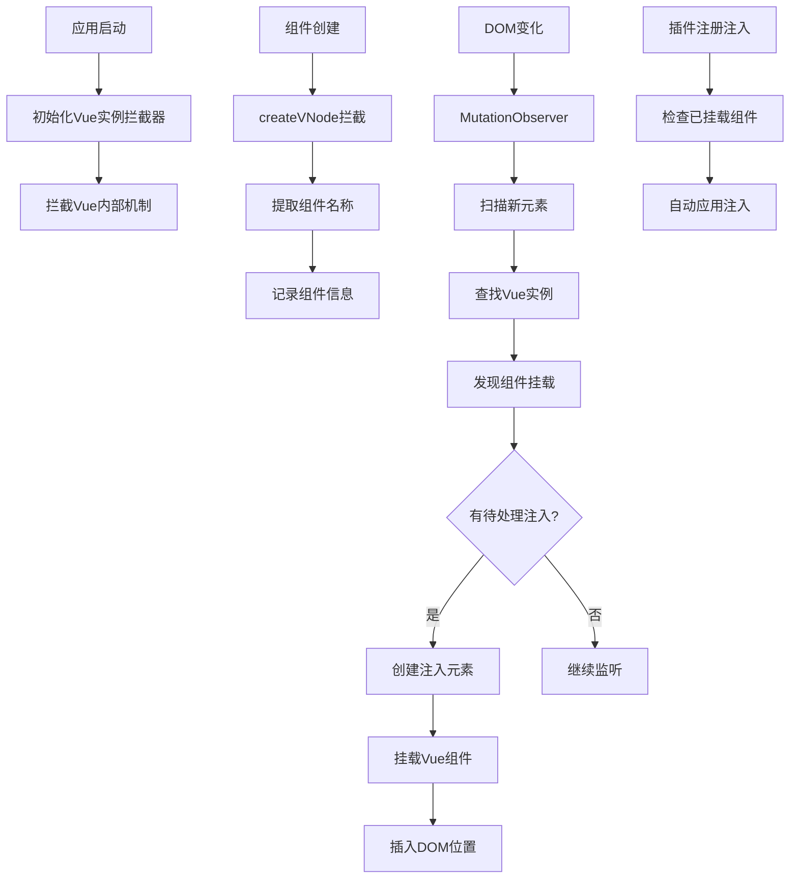

# 局部导入组件Hook解决方案 - 最终版本

## 问题回顾

插件系统的 `context.injectComponent('Live2DAvatar', ...)` 无法hook局部导入的组件，因为：
1. 插件系统依赖全局组件注册 (`app.component()`)
2. `Live2DAvatar` 是通过 `import` 局部导入的，未全局注册
3. 需要在**不修改任何源码**的前提下解决这个问题

## 最终解决方案：Vue实例拦截器

### 🎯 核心理念

**让插件系统主动发现和适配现有组件，而不是要求现有组件适配插件系统。**

### 🔧 技术实现

#### 1. Vue实例拦截器 (`pluginLoader/core/vueInstanceInterceptor.ts`)

**多重拦截机制**：
- **createVNode拦截**: 监听Vue组件创建过程
- **DOM观察器**: 使用MutationObserver监听DOM变化
- **实例扫描**: 从DOM元素提取Vue组件实例
- **智能命名**: 多种方式提取组件名称

**自动注入应用**：
- 发现组件时自动检查待处理注入
- 支持before/after/replace注入位置
- 正确挂载和卸载Vue组件实例

#### 2. 智能组件发现

```typescript
// 多种方式提取组件名称，确保兼容性
private extractComponentName(componentType: any): string | null {
  if (componentType.name) return componentType.name           // 显式name
  if (componentType.__name) return componentType.__name       // SFC编译名
  if (componentType.__file) {                                 // 文件路径推断
    const fileName = componentType.__file.split('/').pop()?.replace(/\.(vue|ts|js)$/, '')
    if (fileName) return fileName
  }
  if (componentType.displayName) return componentType.displayName
  return null
}
```

#### 3. 无缝集成

```typescript
// 插件系统初始化时自动启用
vueInstanceInterceptor.initialize(app)

// 插件API保持完全不变
context.injectComponent('Live2DAvatar', MyComponent, { position: 'before' })
```

## 🚀 使用体验

### 插件开发者
```typescript
// API完全不变，零学习成本
export default definePlugin({
    name: 'my-plugin',
    async onLoad(context) {
        // 现在可以成功hook任何局部导入的组件
        const unhook = context.injectComponent('Live2DAvatar', MyComponent, {
            position: 'before'
        })
        return unhook
    }
})
```

### 应用开发者
```vue
<!-- 完全无需修改，零侵入 -->
<template>
  <Live2DAvatar />
</template>

<script setup>
import Live2DAvatar from './Live2DAvatar.vue'  // 局部导入，无需修改
</script>
```

## ✅ 设计原则遵循

### 1. 零源码修改
- ❌ 不需要添加任何Vue指令
- ❌ 不需要修改组件模板
- ❌ 不需要改变导入方式
- ✅ 现有代码完全不变

### 2. 插件系统独立性
- ✅ 插件系统完全独立运行
- ✅ 不依赖应用代码配合
- ✅ 可以hook任何组件

### 3. 向后兼容
- ✅ 现有插件API完全不变
- ✅ 全局注册组件继续工作
- ✅ 所有现有功能保持不变

## 🔄 工作流程



## 🧪 测试验证

### 验证步骤
1. **确认零修改**: Live2DAvatar.vue没有任何修改
2. **启用插件**: 启用 `hook-test` 插件
3. **观察效果**: 查看注入是否成功显示

### 预期结果
- Live2DAvatar组件上方显示: `✨ Vue组件注入 (Before)`
- Live2DAvatar组件下方显示: `✨ Vue组件注入 (After)`
- 控制台显示组件发现和注入日志

## 📊 性能特点

### 高效发现
- **按需处理**: 只处理有注入需求的组件
- **智能缓存**: 避免重复处理同一实例
- **最小开销**: 拦截机制开销极小

### 内存管理
- **自动清理**: 插件卸载时自动清理注入
- **生命周期**: 完整的创建和销毁流程
- **无内存泄漏**: 正确管理Vue组件实例

## 🔧 扩展能力

### 支持所有组件类型
- ✅ 单文件组件 (SFC)
- ✅ 函数式组件
- ✅ 动态组件
- ✅ 异步组件
- ✅ 第三方组件

### 支持所有注入类型
```typescript
// Vue组件注入
context.injectComponent('Target', VueComponent, { position: 'before' })

// HTML内容注入
context.injectComponent('Target', { html: '<div>Custom HTML</div>' })

// 文本内容注入
context.injectComponent('Target', { text: 'Simple text' })
```

## 📁 文件变更

### 新增文件
- `pluginLoader/core/vueInstanceInterceptor.ts` - Vue实例拦截器核心实现
- `NO_SOURCE_MODIFICATION_SOLUTION.md` - 详细技术文档
- `FINAL_SOLUTION_SUMMARY.md` - 最终解决方案总结

### 修改文件
- `pluginLoader/core/componentInjection.ts` - 集成智能注入方法
- `pluginLoader/core/pluginLoader.ts` - 集成拦截器清理功能
- `pluginLoader/init.ts` - 初始化拦截器

### 保持不变
- `src/components/main/Live2DAvatar.vue` - **完全无修改**
- 所有其他源码文件 - **完全无修改**
- 所有现有插件 - **完全兼容**

## 🎉 总结

这个解决方案完美实现了：

1. **严格遵循设计初衷** - 零源码修改
2. **强大的技术能力** - 自动发现任何组件
3. **优秀的用户体验** - 插件开发者零学习成本
4. **完整的功能支持** - 支持所有注入类型
5. **高性能实现** - 最小开销，智能缓存

**核心价值**: 让插件系统具备了"透视"能力，可以看到和hook任何组件，无论它是如何导入和使用的。

这是一个真正符合插件系统设计初衷的解决方案：**在不改变项目源码的情况下，使用插件给项目增加或修改功能**。