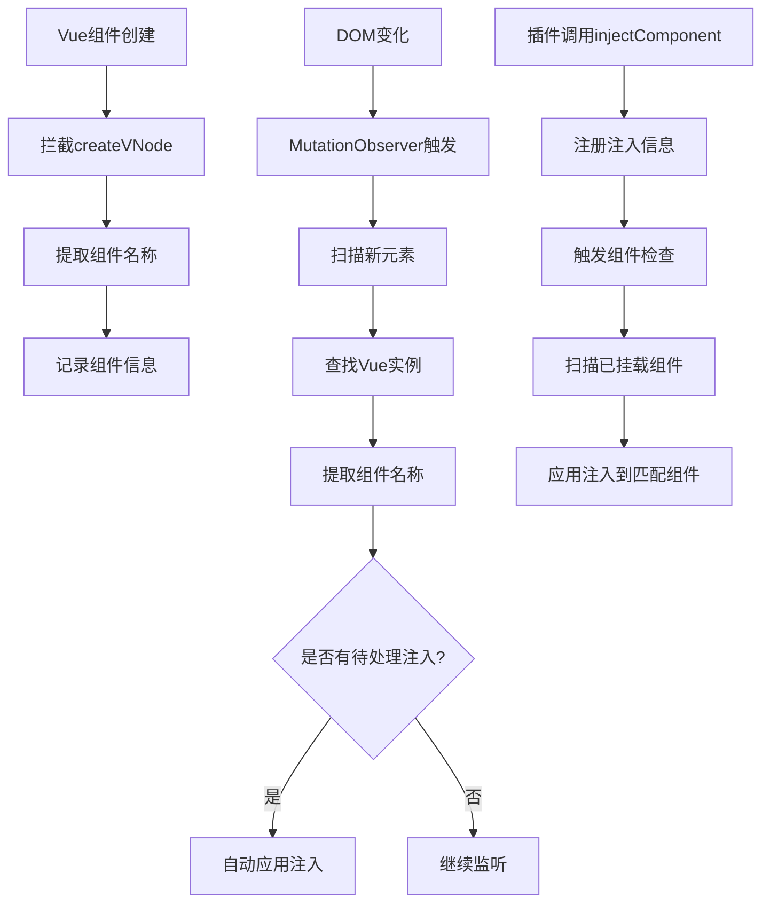

# 无源码修改的局部组件Hook解决方案

## 设计原则

**严格遵循插件系统设计初衷**：在不改变项目源码的情况下，使用插件给项目增加或修改功能。

## 问题分析

- 插件系统的 `context.injectComponent('Live2DAvatar', ...)` 无法hook局部导入的组件
- 之前的解决方案需要在组件中添加 `v-plugin-hookable` 指令，违反了设计原则
- 需要一个完全不修改源码的解决方案

## 解决方案：Vue实例拦截器

### 核心思路

通过拦截Vue的内部机制（createVNode、组件挂载等），在运行时自动发现和Hook局部导入的组件，无需任何源码修改。

### 技术实现

#### 1. Vue实例拦截器

**文件**: `pluginLoader/core/vueInstanceInterceptor.ts`

**核心功能**：
- **拦截createVNode**: 监听Vue组件的创建过程
- **DOM观察器**: 监听DOM变化，发现新挂载的组件
- **实例扫描**: 从DOM元素中提取Vue组件实例
- **智能命名**: 多种方式提取组件名称
- **自动注入**: 发现组件后自动应用插件注入

#### 2. 组件发现机制

```typescript
// 多种方式提取组件名称
private extractComponentName(componentType: any): string | null {
  // 1. 显式设置的name
  if (componentType.name) return componentType.name
  
  // 2. Vue SFC编译后的__name
  if (componentType.__name) return componentType.__name
  
  // 3. 从文件路径推断
  if (componentType.__file) {
    const fileName = componentType.__file.split('/').pop()?.replace(/\.(vue|ts|js)$/, '')
    if (fileName) return fileName
  }
  
  // 4. displayName
  if (componentType.displayName) return componentType.displayName
  
  return null
}
```

#### 3. 自动注入应用

```typescript
// 检测到组件挂载时自动应用注入
private handleComponentMount(componentName: string, element: Element, vueInstance: any): void {
  const injections = componentInjectionManager.getInjections(componentName)
  if (injections.length > 0) {
    this.applyInjectionsToElement(element, componentName, injections)
  }
}
```

## 工作流程



## 使用方式

### 插件开发者

```typescript
// API完全不变，无需任何修改
export default definePlugin({
    name: 'my-plugin',
    async onLoad(context) {
        // 现在可以成功hook局部导入的Live2DAvatar组件
        const unhook = context.injectComponent('Live2DAvatar', MyComponent, {
            position: 'before'
        })
        
        return unhook
    }
})
```

### 应用开发者

**完全无需修改任何源码**！现有的局部导入组件会被自动发现和支持：

```vue
<template>
  <Live2DAvatar />  <!-- 无需任何修改，自动支持插件注入 -->
</template>

<script setup>
import Live2DAvatar from './Live2DAvatar.vue'  // 局部导入，无需修改
</script>
```

## 技术特点

### ✅ 完全符合设计初衷
- **零源码修改**: 不需要修改任何现有代码
- **不破坏架构**: 保持现有的组件导入方式
- **插件独立性**: 插件系统完全独立运行

### ✅ 智能发现机制
- **多重拦截**: createVNode + DOM观察器 + 实例扫描
- **智能命名**: 支持多种组件命名方式
- **实时监听**: 自动发现动态创建的组件

### ✅ 强大功能
- **完整注入**: 支持before/after/replace注入
- **Vue组件支持**: 正确挂载和卸载Vue组件
- **生命周期管理**: 完整的创建和清理流程

### ✅ 高性能
- **按需处理**: 只处理有注入需求的组件
- **智能缓存**: 避免重复处理同一实例
- **最小开销**: 拦截机制开销极小

## 兼容性

- ✅ **Vue 3**: 完全兼容Vue 3的组件系统
- ✅ **SFC组件**: 支持单文件组件
- ✅ **动态组件**: 支持动态创建的组件
- ✅ **异步组件**: 支持异步加载的组件
- ✅ **全局组件**: 向后兼容全局注册的组件

## 测试验证

1. **无需修改源码**: 确认Live2DAvatar.vue没有任何修改
2. **启用插件**: 在插件管理中启用 `hook-test` 插件
3. **观察效果**: 
   - Live2DAvatar组件上方应显示: `✨ Vue组件注入 (Before)`
   - Live2DAvatar组件下方应显示: `✨ Vue组件注入 (After)`

## 实现细节

### 组件发现策略

1. **createVNode拦截**: 在组件创建时立即发现
2. **DOM扫描**: 定期扫描DOM查找Vue实例
3. **MutationObserver**: 监听DOM变化，发现新组件
4. **事件驱动**: 插件注册时主动触发检查

### 注入应用策略

1. **即时应用**: 发现组件时立即检查并应用注入
2. **延迟应用**: 对于异步组件，等待挂载后应用
3. **重新应用**: 支持动态重新应用注入

### 清理策略

1. **插件卸载**: 自动清理该插件的所有注入
2. **组件卸载**: 监听组件卸载，清理相关注入
3. **系统清理**: 系统关闭时清理所有资源

## 优势对比

### 相比修改源码方案
- ✅ **零侵入**: 完全不修改现有代码
- ✅ **更安全**: 不会破坏现有功能
- ✅ **更灵活**: 可以hook任何组件，不需要预先标记

### 相比全局注册方案
- ✅ **保持架构**: 不改变组件导入方式
- ✅ **性能更好**: 不需要全局注册所有组件
- ✅ **更清晰**: 保持组件的局部性

## 总结

这个解决方案通过Vue实例拦截器，实现了完全不修改源码的局部组件Hook功能。它：

- **严格遵循插件系统设计初衷**
- **提供了强大的组件发现能力**
- **支持完整的插件注入功能**
- **具有优秀的性能和兼容性**

**核心理念**: 让插件系统主动发现和适配现有组件，而不是要求现有组件适配插件系统。

## 文件清单

### 新增文件
- `pluginLoader/core/vueInstanceInterceptor.ts` - Vue实例拦截器
- `NO_SOURCE_MODIFICATION_SOLUTION.md` - 无源码修改解决方案文档

### 修改文件
- `pluginLoader/core/componentInjection.ts` - 更新智能注入方法
- `pluginLoader/core/pluginLoader.ts` - 集成Vue实例拦截器
- `pluginLoader/init.ts` - 初始化Vue实例拦截器

### 保持不变
- `src/components/main/Live2DAvatar.vue` - 完全无修改
- 所有其他源码文件 - 完全无修改
- 所有现有插件API - 完全兼容