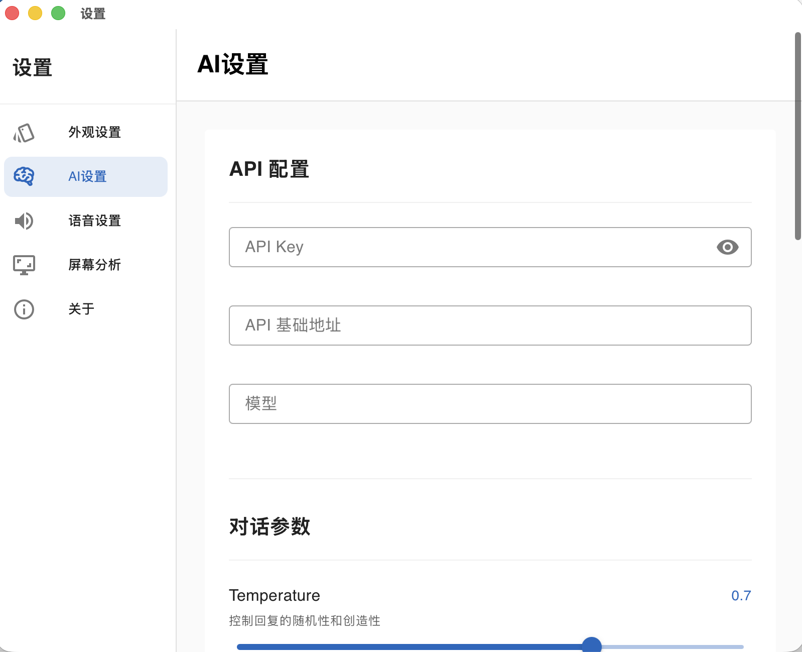
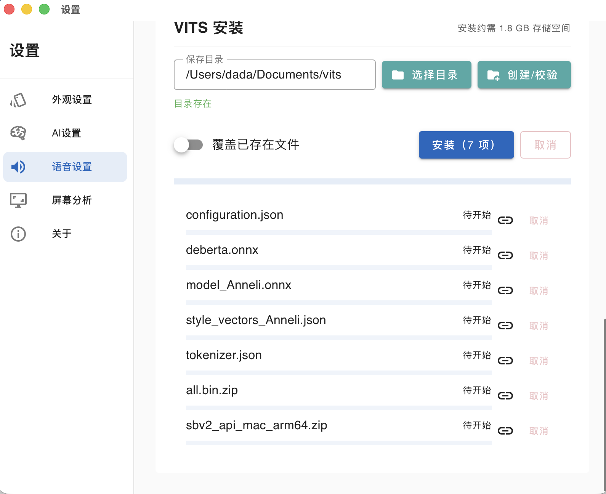

# LingPet 灵宠

<p align="center">
  
</p>

LingPet 是一款开源的桌宠。

美术资源来自[LingChat](https://github.com/SlimeBoyOwO/LingChat/blob/develop/ling_chat/core/ai_service/rag_manager.py)，特此感谢。

**commit 经过精心设计，浏览 commit 历史可以了解桌宠的开发历程并逐步学习**。

## ✨ 核心功能

- **智能对话**: 与桌宠进行流畅、自然的实时对话。
- **情感化身**: 桌宠拥有多种可变头像，能根据对话内容展现出高兴、悲伤、好奇等多种情绪。
- **语音合成 (TTS)**: 集成 Style-Bert-Vits2 语音合成技术，让您能听到桌宠的声音。
- **屏幕分析**: 独特的功能，允许桌宠“看到”您的屏幕内容，并据此提供相关的评论或帮助。
- **跨平台**: 基于 Tauri 构建，可运行在 Windows、macOS 和 Linux 系统上。

## 使用

### 1. 将鼠标悬停在桌宠，点击右上角浮现的设置图标
<p align="center">
  
</p>

### 2. 按照OpenAI格式配置好大语言模型的api设置

如：
- sk-**********
- https://api.deepseek.com/v1  (记得加https)
- deepseek-chat

配置好后可以点击测试连接测试是否成功。

<p align="center">
  
</p>

### （可选）3. 安装Style-bert-vits2语音系统

1. 切换到Vits设置，打开总开关
2. 选择一个合适的文件
3. 点击安装（下载完成前不要关闭窗口）
4. 下载完成后，回到页面上方点击绿色按钮“启动本地语音服务”
5. 等待10秒，点击测试连接看看是否成功
6. （可选）如果希望每次启动桌宠就自动启动语音服务，可以打开对应的开关

<p align="center">
  
</p>


## 🛠️ 技术栈

- **前端**: Vue 3, Vite, TypeScript, Vuetify
- **后端**: Rust, Tauri
- **AI**: 大语言模型集成
- **TTS**: [sbv2-api](https://github.com/neodyland/sbv2-api)

## 🚀 快速开始 （开发）

### 1. 环境准备
请确保您已安装 [Node.js](https://nodejs.org/)、[pnpm](https://pnpm.io/) 以及 [Rust 环境和 Tauri 依赖](https://tauri.app/v1/guides/getting-started/prerequisites)。

### 2. 克隆项目
```bash
git clone https://github.com/kono-dada/Ling-Pet.git
cd Ling-Pet
```

### 3. 安装依赖
```bash
pnpm install
```

### 4. 运行开发环境
```bash
pnpm tauri dev
```

### 5. 构建应用
```bash
pnpm tauri build
```

## 💡 IDE 配置推荐

- [VS Code](https://code.visualstudio.com/)
- [Volar (Vue 官方插件)](https://marketplace.visualstudio.com/items?itemName=Vue.volar)
- [Tauri](https://marketplace.visualstudio.com/items?itemName=tauri-apps.tauri-vscode)
- [rust-analyzer](https://marketplace.visualstudio.com/items?itemName=rust-lang.rust-analyzer)